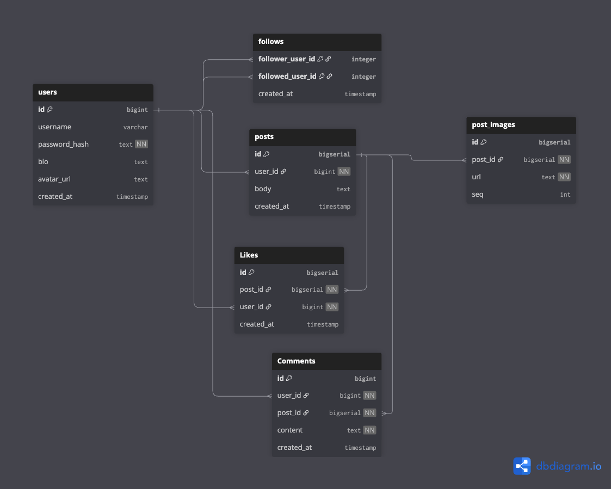
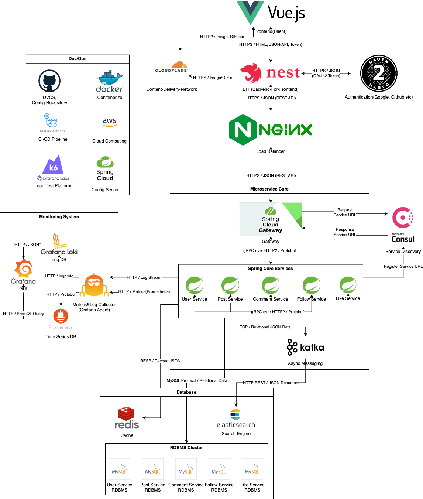

# Instagram-Clone
Instagram Clone with Microservice Architecture

## Workflow

(0. 서비스 설계, 요구사항 분석 - 클론 프로젝트이므로 생략)

1. 데이터 모델링, ERD 초안

2. API 명세

https://www.notion.so/Instagram-Clone-API-2b02b42602558028a96ad8f99a7fa4ec?source=copy_link

3. 아키텍처 디자인

4. 스키마 구체화

5. DB 마이그레이션

6. 코드 작성

7. 코드 작성

8. 피드백